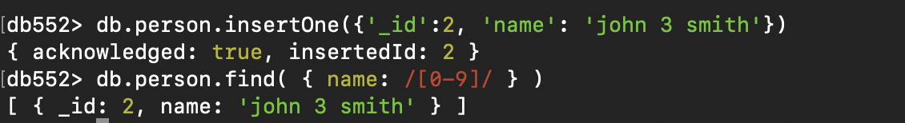

# MongoDB

启动mongodb：`mongosh`

`use db552`

`db`

`show tables`

查询：`db.person.find()`

新增：`db.person.insertOne()`

​			`db.person.insertMany()`


### Tips:

1. we can omit "" on keys when 查询.

2. logical operators:

   `$or`, `$and` can be top-level operator

​		`$not` cannot be top-level operator

3. Comparison operators:

   `$lt`, `$gt`, `$lte`, `$gte`, `$eq`, `$ne`, `$in`, `$all`


`i` means case-insensitive.

含有数字：



**start with** :`^` and **end with** : `$`


### Projection

是否返回指定attribute：


其中_id是特殊的。默认显示，可以通过 ` _id: 0` 来让它不显示。`xx: 0` 对其他attribute不适用。其他attribute可以写 `xx: 1`。就很神奇：


原因：Can not mix 1 and 0 conditions (unless it is "_id")


### Matching elements in array


### count


 ### Condition on document elements of array

见ppt p26，27


### sorting:  `.sort()`

 1 for ascending; -1 descending


### limit and skip

就等于xml里面的limit和offset


### distinct


以上等效于sql：`select distinct age from Person where age > 28`


注意：不能和find一起用：


### Renaming

`{newName: '$oldName'}`


### Writing Javascript in Mongo Shell


Using javascript cursor in MongoDB:


Using `forEach` function in MongoDB:


### Update

`updateOne`


`updateMany`


##### set and unset

unset就是把这个属性去掉，参数可以填任何东西。反正它也没了。标准就是填null。


### _upsert_ (update if exists; otherwise insert.)

如果没有指定的复合要求的attribute，update会失败。如下图，没有_id=6。所有返回值结果都是0。


啊？为什么不行？？？


### delete


### Remove documents, collection/table

`db.person.remove({})`   This will remove documents/records of _person_.

`db.person.remove({ _some_condition_here_ })`

`db.person.drop()     This will remove the person collection/table.


### dot operation:  Sub-strings


### Aggregation 
The aggregate method in MongoDB is used for performing data aggregation operations, which involve *grouping*, *transforming*, and analyzing data from one or *more* collections. 

##### sum


In sql: `select category, sum(qty) from product group by category`

##### count


In sql: `select category, count(*) from product group by category`

##### aggregation with _having_

use _$match_ keyword.


##### aggregation on more than one field


##### aggregation pipeline


##### Projection in aggregate

```txt
db.product.aggregate(
  {$group:
    {_id: null, max: {$max: "$qty"} }
  }
)

output:
{ "_id" : null, "max" : 45 }
```

Remove _id from result:

```
db.product.aggregate(
    {$group:
      {_id: null, max: {$max:"$qty"} }
    }, 
    {$project: {_id: 0} }
)

output:
{ "max" : 45 }
```


### $lookup for joining two collections

```
db.person.aggregate(
    {$lookup: {
       from: 'department', 
       localField: 'deptID', 
       foreignField: "_id", 
       as: 'res'
       }
    }, 
    {$match: 
      {name: {$ne: null}}
    }, 
    {$project: 
      {name: 1, 'res.name': 1, _id: 0}
    }
)
```

### $unwind

db.person.aggregate(
  {$unwind: '$scores'}
)